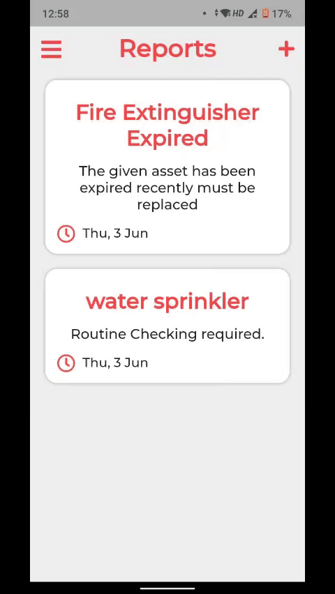

# Firefighter Inventory App

Firefighter inventory management and service app created for the hackathon [Hackwell2.0](https://www.jsshackwell.in/). Which was a 48 hour hackathon organized by [JSSATEB](https://www.jssateb.ac.in/) and [Honeywell India](https://www.honeywell.com/in/en).
This project was selected as one of the top 10 projects of the hackathon.

# Problem Statement

-   Fire extinguisher are maintained manually with paper tag for each fire extinguisher cylinder
-   Can’t predict how many cylinders/equipment needs to be replace
-   Don’t have report facility, mostly on papers with bare minimum insights
-   Don’t have digital maintenance record

# App Demo

-   Adding a `site` for asset management
    

-   Adding a `asset` for service and management.
    

-   Scanning auto generated QR code for all `asset` and to start and finish servicing it.
    

-   Adding a `report` for an `asset` in a `site` and assigning a `site engineer` to it.
    

# Technology Stack

-   Frontend: [Flutter](https://flutter.dev/)(with sound null safety).
-   State management: [RiverPod](https://pub.dev/packages/riverpod) and [FlutterHooks](https://pub.dev/packages/flutter_hooks).
-   Backend: [Firebase](https://firebase.google.com/)

# Getting Started

A complete guide for getting started is given **[here](https://github.com/VarunSAthreya/Firefighter/blob/main/CONTRIBUTING.md)**.
